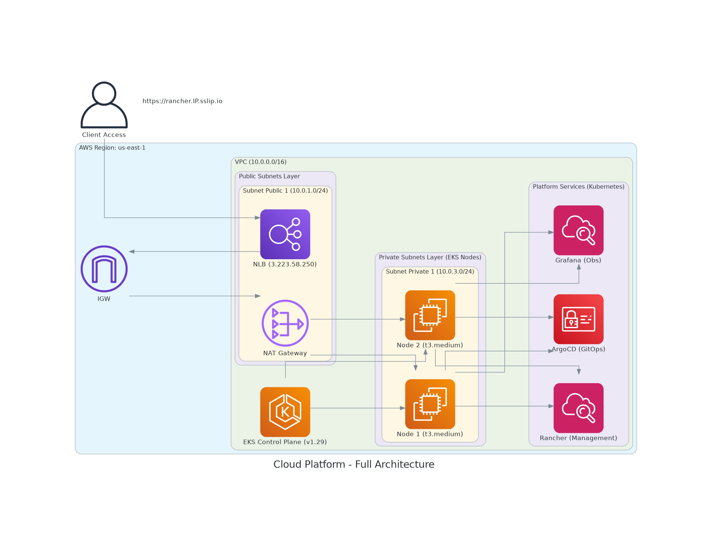

# 🚀 Enterprise Cloud Platform: AWS + Kubernetes + GitOps

> **Status do Projeto:** Production-Ready Framework (Framework Pronto para Produção) 🛠️

Este repositório contém a implementação de uma plataforma de engenharia moderna, utilizando o conceito de **Internal Developer Platform (IDP)**. O foco é automatizar o provisionamento de infraestrutura em nuvem e a entrega de software com máxima segurança, observabilidade e controle de custos.

---

## 📄 Visão Geral e Contexto de Negócio

No cenário atual de transformação digital, muitas empresas enfrentam o **"Gargalo da Agilidade"**. A infraestrutura manual ou mal estruturada gera:
*   **Lentidão no Time-to-Market:** Demora de dias ou semanas para subir novos ambientes.
*   **Erros Humanos:** Configurações inconsistentes entre ambientes de Dev e Prod.
*   **Custos Incontroláveis:** Gastos excessivos em Cloud por falta de visibilidade e governança.

**Este projeto resolve essas dores através de:**
1.  **Infraestrutura como Código (IaC):** Replicação idêntica de ambientes em minutos.
2.  **GitOps:** O Git como a única fonte da verdade para o estado do cluster.
3.  **Observabilidade Nativa:** Monitoramento proativo para evitar downtime.

---

## 🏗️ Arquitetura da Solução

A solução foi desenhada em duas camadas complementares, seguindo as melhores práticas da AWS (Well-Architected Framework).

### 1. Infraestrutura de Nuvem (AWS Layer)
Focada em isolamento de rede, resiliência e segurança perimetral.

### 2. Ecossistema de Software (Cluster Layer)
Organização lógica dos serviços de plataforma e aplicações de negócio gerenciados via GitOps.

---

## 🛠️ Stack Tecnológica

| Camada | Ferramentas |
| :--- | :--- |
| **Cloud Provider** | Amazon Web Services (AWS) |
| **Infraestrutura (IaC)** | Terraform & Terragrunt |
| **Orquestração** | Kubernetes (Amazon EKS v1.29) |
| **Entrega Contínua (GitOps)** | Argo CD |
| **Gestão de Cluster** | Rancher Manager |
| **Segurança de Rede** | Nginx Ingress + Cert-Manager |
| **Disponibilidade (SRE)** | Uptime Kuma |

---

## 💰 Gestão Financeira Automática (FinOps)

Nesta consultoria, implementamos o **Infracost**, que analisa o código IaC e prevê os custos antes do deploy. O relatório abaixo reflete a análise real do projeto:

| Projeto | Recurso Principal | Custo Mensal |
| :--- | :--- | :--- |
| **EKS Project** | Cluster + Nodes + KMS | $503.94 |
| **VPC Project** | NAT Gateway + Network | $32.85 |
| **TOTAL GERAL** | | **$536.79** |

### 💡 Insight Consultivo de Redução de Custo:
O Infracost detectou que **$438.00** do custo mensal (mais de 80% da fatura) é referente ao **Extended Support** da AWS para a versão 1.29 do Kubernetes.
*   **Ação:** Realizar o upgrade para a versão **1.30**.
*   **Economia Estimada:** **R$ 2.400,00/mês (Aprox. $438 USD)**. 
*   *Este projeto prova que a arquitetura bem gerida se paga através da manutenção preventiva.*

---

## 🚀 Como este ambiente é implantado

1.  **Provisionamento de Infraestrutura:** 
    Navegue até a pasta `live/dev/` e execute `terragrunt run-all apply`.
2.  **Bootstrap da Plataforma:**
    Instale o Argo CD via Helm e aplique o manifesto em `kubernetes/bootstrap/root-app.yaml`.
3.  **Sincronização Automática:**
    O Argo CD assumirá o controle e provisionará automaticamente o Ingress-Nginx, Cert-Manager, Rancher e o Uptime Kuma.

---

## 👤 Autor

**Felipe Carpanezi**  
*Cloud Architect & Platform Engineer*

*   [LinkedIn](https://www.linkedin.com/in/felipe-carpanezi-b5440334/)
*   [GitHub](https://github.com/Felipe-carpanezi)